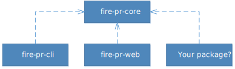

For more details go to.

## Architecture

This architecture is created to create the best reusability of this code. This project has one base module which is called `fire-pr-core` and will be the base for the official `fire-pr-cli` and `fire-pr-web`. This will also be shown in the following diagram:

## License

[MIT](./LICENSE)

Copyright (c) 2017-present, 3YOURMIND GmbH
